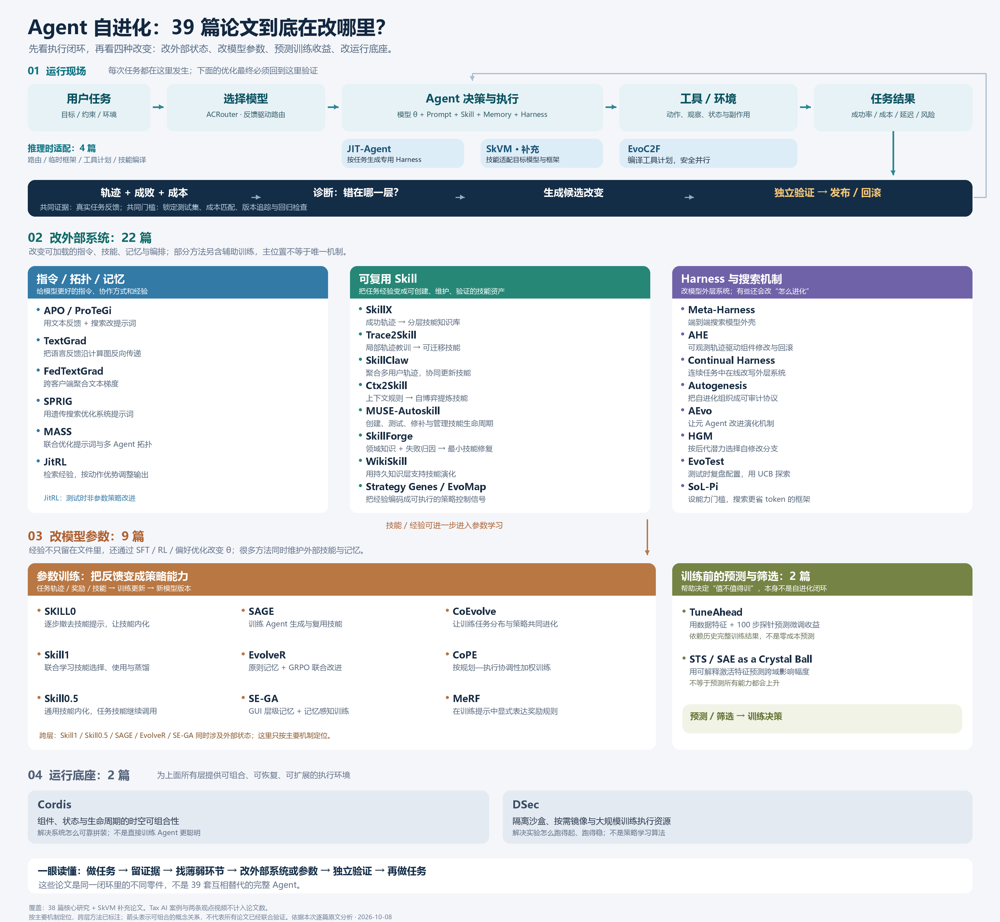

# Agent 自动优化 / Agent 进化研究

本仓库整理 B 站合集“Agent自动优化（Agent进化）[论文]”的 41 个视频条目，保存并校验 38 份核心论文 PDF 与 1 份补充论文 SkVM，给出逐篇中文分析、主题全景图、三项真实运行记录和可接续研究入口。



> 全景图按主要作用位置组织，不是时间谱系，也不表示 39 篇工作已组成一套经过联合验证的系统。可点击 [离线 HTML 报告](reports/index.html) 查看内嵌高清图和完整审计。

## 当前结论

- 论文语料：38 份合集核心 PDF + 1 份补充 PDF，共 39 份、1082 页。
- 合集非论文项：第 19 项为官方行业文章；第 20、31 项为评论/综述视频。
- 证据等级：完整论文复现 0、缩小真实实验 0、公开工件回放 1、合成机制示例 2。
- ACRouter 的 176 题结果是固定顺序 cascade 的发布矩阵重放；不是实时模型调用、在线路由学习或论文 v3 表 3 的复算。
- 所有本地实验不调用付费 API，不需要凭据，也不运行第三方项目代码。

详见 [RESEARCH_STATUS.md](RESEARCH_STATUS.md) 和 [EVIDENCE_LEVELS.md](EVIDENCE_LEVELS.md)。

## 目录

| 路径 | 内容 |
|---|---|
| `papers/` | 38 份核心 PDF；`supplemental/` 中另有 SkVM |
| `text/` | 从 PDF 提取的可检索文本，仅作研究资料 |
| `metadata/paper_registry.json` | 稳定 paper_id、视频、版本、PDF、哈希、主题与分析位置映射 |
| `metadata/agent_evolution_map.json` | 39 项主题地图源数据、跨层边与来源 URL |
| `assets/Agent_自进化论文全景图.png` | 3600×3320 全景图 |
| `research_notes/` | 8 份按主题组织的中文独立核验笔记 |
| `experiments/` | ACRouter 工件回放与两个合成机制实验 |
| `reports/index.html` | 可离线打开的完整 HTML 报告 |
| `tools/` | 索引、主题图、实验、报告与完整性校验入口 |
| `templates/` | 新增论文、发现与实验记录模板 |

## 快速开始

私有仓库需要相应 GitHub 权限：

```bash
git clone https://github.com/100apps/agent-evolution-research.git
cd agent-evolution-research
python tools/research.py validate
```

安装报告和主题图的锁定依赖：

```bash
python -m venv .venv
# Windows: .venv\Scripts\python -m pip install -r requirements.txt
# Linux/macOS:
.venv/bin/python -m pip install -r requirements.txt
```

在新目录中运行验证、三个实验和报告构建：

```bash
python tools/research.py all --output-dir run_outputs/clean-run
```

该命令不会覆盖已提交实验记录；它把新运行结果写入指定目录。验证和三个实验本身只使用 Python 标准库；报告/全景图构建使用 `requirements.txt`。

可选的真实浏览器验收使用 `requirements-qa.txt`，并运行 `python tools/visual_qa.py`；脚本默认调用本机 Edge，不下载浏览器。

## 如何继续研究

1. 让 Agent 先读 [AGENTS.md](AGENTS.md)。
2. 从 [BACKLOG.md](BACKLOG.md) 选择一个有验收条件的问题。
3. 用 [templates/experiment_record.md](templates/experiment_record.md) 写预注册式计划。
4. 核对输入哈希，在离线 baseline 上先产生 expected/actual。
5. 只在得到额外授权后接入模型、外部代码或有费用的服务。
6. 更新 registry、状态、研究笔记和 HTML，并运行 `python tools/research.py all ...`。

## 研究边界与版权

PDF、论文正文、上游数据和提取文本的权利归各自作者、出版社或来源方；保留文件是为了可验证研究与复现。它们不因进入本仓库而获得本项目许可证。本仓库没有为全部内容选择统一开源许可证，也没有把第三方资料声明为自有作品。使用者应遵守各来源页面和所在地法律。

本仓库不包含凭据、token、浏览器配置、安装环境、缓存或交付 ZIP；`tmp/` 与 `run_outputs/` 不提交。

